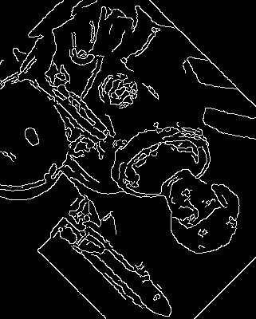
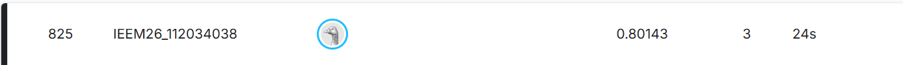

# Machine Learning Projects

Nine machine-learning projects from one semester of *Introduction to Machine Learning* (NTHU IEEM, 2026), covering tabular classification, time-series forecasting, computer vision, Chinese NLP, and sign-language recognition — with every reported number traced back to the notebook that produced it.

---

## Demo

**EX4 — Computer vision pipeline.** A photo is denoised with a median filter, rotated 45°, then passed through Canny edge detection. A bonus step registers the rotated image back onto the original using ORB features and a RANSAC homography.



**EX3 — Kaggle Titanic leaderboard.** Final standing for the 100-model TF-DF ensemble.



---

## What it does

Each folder is a self-contained project. There is no shared library and no service to deploy. Every project reads a public dataset, trains a model, and writes either a metric or a Kaggle submission file.

| Project | Task | Headline result |
|---|---|---|
| EX1 | Heart-failure mortality — binary classification | Random Forest F1 **0.5789** |
| EX2 | t-SNE dimensionality reduction on digits | 2D cluster visualisation |
| EX3 | Kaggle Titanic — survival prediction | Public LB **0.80143** |
| EX4 | Image filtering, rotation, edge detection, registration | Canny output + ORB/RANSAC homography |
| EX5 | Traditional Chinese word segmentation, POS, NER | CKIPtagger WS/POS/NER output |
| HW1 | Data preprocessing — garment worker productivity | 8 cleaning tasks on 1,197 rows |
| HW2 | Kaggle store sales — time-series forecasting | Public LB **0.40045** RMSLE |
| HW3 | Kaggle irrigation need — 3-class classification | Kaggle **0.98054** balanced accuracy |
| HW4 | Kaggle F1 pit-stop prediction — binary, AUC | Kaggle AUC **0.94714** |
| Case study | Google Isolated Sign Language Recognition | Private LB **0.7433670** (post-deadline; team of 3, slides only) |

Full derivations for every number are in [`docs/metrics.md`](docs/metrics.md).

---

## Where the hard parts are

**Deployment constraints drove the ASL architecture, not accuracy.** The competition required a TFLite model under 40 MB with inference under 100 ms per video. All preprocessing had to be expressed as TensorFlow tensor ops and baked in as the model's first layer. That ruled out large architectures and any NumPy-based feature engineering. The first submission scored 0.0087 — its only job was proving the submission format was valid.

**HW4 hit a hard ceiling that hyperparameters could not move.** Three consecutive submissions returned exactly 0.94714 AUC despite a changed learning rate and an added XGBoost blend. AUC only measures the *ordering* of predictions. The tuning shifted probabilities without changing which samples ranked above which, so the metric could not move. Breaking the plateau required a third model with a different inductive bias — CatBoost — combined by weighted soft voting at 40 / 35 / 25.

**HW3's last gain came from disagreement, not from a better model.** The LightGBM out-of-fold score was 0.9792; Optuna tuning per-class probability multipliers lifted it to 0.9795 with the model untouched. The final submission then used conditional voting across four earlier submissions: where three weaker models agreed, their consensus was used; where they disagreed, the best model decided. Only 798 of 270,000 rows were contested, and that was worth +0.00024 on Kaggle.

**Three things that made results worse, and why.** Recorded because negative results are the part of an ablation study that actually teaches something.

| Attempt | Effect | Cause |
|---|---|---|
| HW3 — pseudo-labelling 270k test predictions back into training | 0.98030 → **0.97153** | At 98% accuracy, 2% of the pseudo-labels are wrong. The model memorised them and the class boundaries degraded. Confirmation bias. |
| HW3 — casting `float64` → `float32` to fit Colab's free-tier RAM | small drop | Tree models split on exact thresholds. Lower precision blurs the split points. |
| HW2 — combining `store_nbr` × `family` into one feature | score worsened | The feature was specific enough for the model to memorise individual store-product pairs instead of learning a trend. |
| HW4 — raising the XGBoost blend weight to 0.45 | fell below baseline | XGBoost was over-sensitive to the boundaries of this synthetic dataset; the prediction distribution deformed. Cut back to 0.25. |

**HW2 traded data volume for recency.** Training on 2013–2017 performed worse than training on 2017 alone. The earlier years carry shocks that no longer describe current behaviour — the 2016 earthquake among them. In time-series forecasting the currency of the data beat the quantity of it.

**EX5 cannot be run from a clean checkout.** CKIPtagger's model weights are 1.88 GB and live in Google Drive. The notebook also pins `tensorflow==2.8.0`, which no longer resolves on Python 3.12. See [`docs/known-issues.md`](docs/known-issues.md).

---

## Repository layout

```
.
├── README.md                                  This file
├── LICENSE                                    MIT licence for the code in this repo
├── .gitignore                                 Excludes datasets, model weights, credentials, OS junk
├── .env.example                               Template for the credentials the notebooks expect
├── Kaggle Case Study.pdf                      ASL recognition slide deck (3-person team)
│
├── docs/
│   ├── architecture.md                        Shared pipeline structure and per-project data flow
│   ├── metrics.md                             Provenance for every number in this README
│   ├── known-issues.md                        Known defects and open questions
│   ├── contributing.md                        Authorship, team attribution, contribution guide
│   ├── diagrams/
│   │   ├── shared-pipeline.mmd                Mermaid source — common tabular pipeline
│   │   ├── hw3-ensemble.mmd                   Mermaid source — HW3 conditional voting
│   │   └── asl-tflite-pipeline.mmd            Mermaid source — ASL TFLite constraint flow
│   └── images/                                Rendered diagram exports
│
├── EX1/
│   └── 112034038_林彥妤.ipynb                  Heart failure — 4 classifiers compared by F1
│
├── EX2/
│   └── 112034038_林彥妤.ipynb                  t-SNE on sklearn digits, classes 0–5
│
├── EX3/
│   ├── 112034038_林彥妤.ipynb                  Titanic — 100-seed TF-DF GBT ensemble (notebook)
│   ├── 112034038_林彥妤.py                     Same pipeline exported as a script
│   └── 112034038_林彥妤.png                    Kaggle leaderboard screenshot (0.80143)
│
├── EX4/
│   ├── 112034038_林彥妤.ipynb                  OpenCV — denoise, rotate, Canny, ORB registration
│   └── 112034038_林彥妤.jpg                    Canny edge-detection output
│
├── EX5/
│   └── 112034038_林彥妤.ipynb                  CKIPtagger — Chinese WS, POS, NER
│
├── HW1/
│   └── 112034038_林彥妤.ipynb                  Garment productivity — 8 preprocessing tasks
│
├── HW2/
│   ├── Homework2_112034038_林彥妤.ipynb        Store sales — final XGBoost config (notebook)
│   ├── Homework2_112034038_林彥妤.py           Final config as a script (2500 / 0.016 / depth 11)
│   ├── Homework2_112034038_林彥妤.docx         Written report
│   ├── Homework2_112034038_林彥妤.doc          Older binary copy of the report
│   ├── 0.40045.ipynb                          Scoring run — 2000 / 0.020 / depth 11
│   ├── 0.40045.py                             Script form of the 0.40045 run
│   ├── 0.40115.ipynb                          Earlier run — 1800 / 0.025 / depth 9
│   ├── 0.40115.py                             Script form of the 0.40115 run
│   ├── Deal With the Problem.docx             Problem-analysis write-up
│   └── Deal With the Problem.pdf              PDF export of the same write-up
│
├── HW3/
│   ├── Homework3_112034038_林彥妤.ipynb        Final conditional-voting ensemble
│   ├── Homework3_112034038_林彥妤.py           Script form of the ensemble
│   ├── Homework3_112034038_林彥妤.docx         Written report
│   ├── code/
│   │   ├── 0.98030.ipynb                      LightGBM + target encoding + Optuna weights
│   │   ├── 0.98030.py                         Script form of the LightGBM run
│   │   ├── lgb_0.98030_probibilities.ipynb    Same model, also exports class probabilities
│   │   └── lgb_0.98030_probibilities.py       Script form of the probability export
│   └── essemble/
│       └── irrigation-need-catboost-threshold-optimization.ipynb
│                                              CatBoost, 10×5 nested CV, threshold search
│
├── HW4/
│   ├── Homework4_112034038_林彥妤.ipynb        LightGBM + XGBoost blend for pit-stop prediction
│   └── Homework4_112034038_林彥妤.docx         Written report
│
└── One Page Sum/
    └── 112034038_林彥妤.pdf                    One-page model-selection reference sheet
```

---

## Tech stack

| Layer | Tools |
|---|---|
| Language | Python 3.12 |
| Runtime | Google Colab, Kaggle Notebooks |
| Tabular models | LightGBM, XGBoost, CatBoost, scikit-learn |
| Deep learning | TensorFlow, TensorFlow Decision Forests, TensorFlow Lite |
| Tuning | Optuna (TPE sampler), SciPy `optimize.minimize` (Nelder–Mead) |
| Computer vision | OpenCV, scikit-image |
| Chinese NLP | CKIPtagger |
| Data | pandas, NumPy |
| Plotting | Matplotlib |

---

## Running locally

Every project runs from a notebook. There is no build step and no server.

**1. Clone and create an environment.**

```bash
git clone https://github.com/stephanieyenyu/Machine_Learning_Project-NTHU.git
cd Machine_Learning_Project-NTHU
python3.12 -m venv .venv && source .venv/bin/activate
pip install -r requirements.txt      # see docs/known-issues.md — not yet committed
```

**2. Set up credentials.**

Copy the template and fill in your own Kaggle API token from <https://www.kaggle.com/settings>.

```bash
cp .env.example .env
```

Projects that download data through the Kaggle CLI also need `~/.kaggle/kaggle.json`. Both `.env` and `kaggle.json` are gitignored. Never commit either.

**3. Fetch the datasets.** No dataset is committed — `.gitignore` excludes `*.csv`, `*.npy`, `*.pkl`, and `*.h5`. Each project sources its data differently:

| Project | Data source |
|---|---|
| EX1 | `Heart Failure Clinical Records.csv`, uploaded manually in the notebook |
| EX2 | `sklearn.datasets.load_digits(n_class=6)` — no download needed |
| EX3 | Kaggle *Titanic* competition files, placed beside the notebook |
| EX4 | A local image named `ex4.jpg` |
| EX5 | CKIPtagger weights (1.88 GB) via `gdown`, then a local path |
| HW1 | A Google Drive CSV read directly by file ID |
| HW2 | Kaggle CLI download of the course competition |
| HW3, HW4 | Kaggle Playground Series files, auto-located under `/kaggle/input` |

**4. Open the notebook and run all cells.** Colab is the intended environment for EX1–EX5 and HW1–HW2. HW3 and HW4 assume Kaggle Notebooks. Paths and mount points differ between the two — see [`docs/known-issues.md`](docs/known-issues.md).

---

## Author

**Stephanie Lin (林彥妤)**
Industrial Engineering and Engineering Management, National Tsing Hua University
GitHub: [@stephanieyenyu](https://github.com/stephanieyenyu)

The ASL sign-language case study was a three-person team project. Authorship and per-person contributions are recorded in [`docs/contributing.md`](docs/contributing.md).

## Licence

Code in this repository is released under the MIT Licence — see [`LICENSE`](LICENSE).

This does not extend to third-party material. Datasets keep their original licences (UCI, Kaggle competition rules, scikit-learn's bundled digits data). CKIPtagger models are licensed by CKIP Lab. Course handouts, assignment specifications, and supplied starter code remain the property of the course instructor and are not relicensed here.

