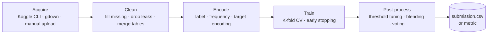
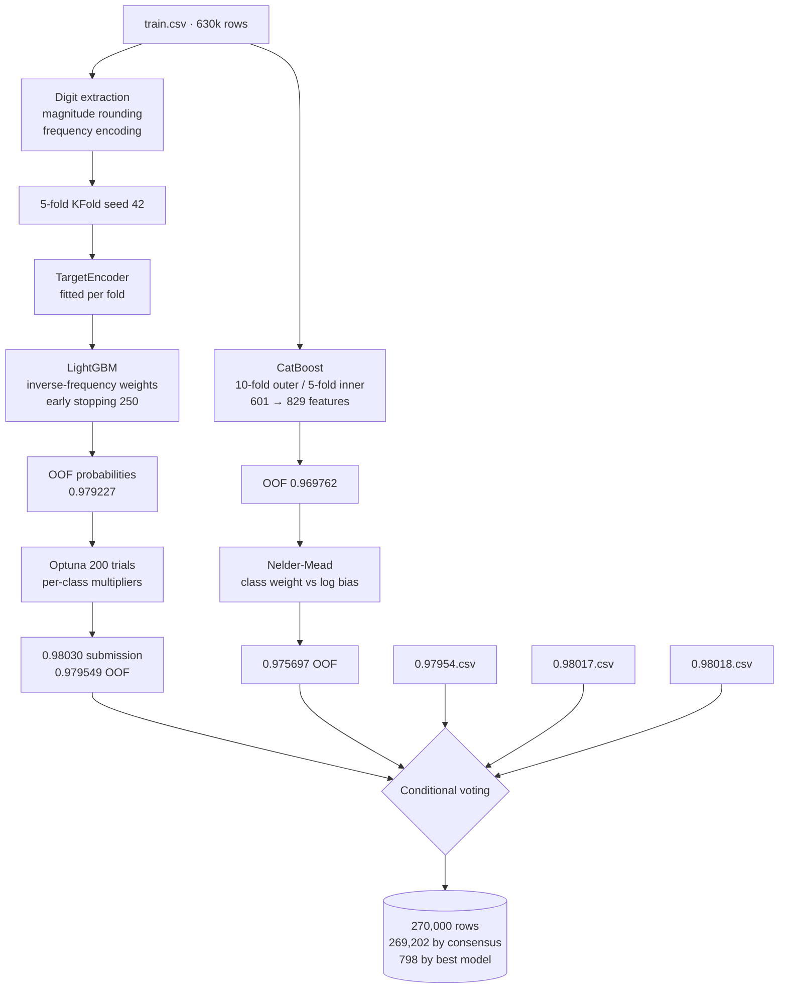
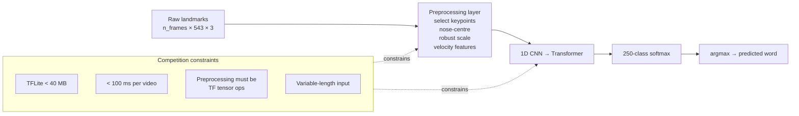

# Architecture

## Scope of This Document

This repository has no system architecture in the usual sense. There is no service, no API, no database, no deployment target, and no shared library. Each project is a standalone notebook that reads a dataset and writes either a metric or a submission file.

What this document describes instead is the **pipeline structure the projects share**, where individual projects deviate from it, and how data moves through each one. That is the level at which the design decisions actually live.

---

## The Shared Pipeline

Seven of the nine projects — EX1, EX3, HW1, HW2, HW3, HW4, and the tabular half of EX2 — follow the same five stages.



Stage boundaries are not enforced by any code structure. They exist as cell groups inside each notebook. Nothing is importable, and no stage is reused across projects.

### Where the Interesting Work Happens

Stages 1 and 2 are routine. Almost every point of difference between a mediocre and a good result in this repository sits in stages **3** and **5**.

| Stage | Routine version | What actually moved the score |
|---|---|---|
| Encode | Label-encode categoricals | HW3: digit extraction per decimal place, frequency encoding with a rare-value bucket, out-of-fold target encoding |
| Train | One model, one split | HW3/HW4: 5- or 10-fold CV, early stopping, per-fold seeds |
| Post-process | `argmax` | HW3: Optuna class-weight search, then conditional voting. HW4: fixed-weight blend |

Stage 5 is worth naming separately because it is invisible in most write-ups. In HW3 the entire reported gain from 0.9792 to 0.9795 came from stage 5 with the model untouched. See [`metrics.md`](metrics.md).

---

## Per-Project Data Flow

### EX1 — Heart Failure

```
Heart Failure Clinical Records.csv (manual upload)
  → drop [time, DEATH_EVENT] → X (11 features, 299 rows)
  → train_test_split(0.25, seed 2)
  → {LogisticRegression, XGBoost, DecisionTree, RandomForest}
  → f1_score on the positive class
```

`time` is dropped deliberately. It encodes the follow-up window, which is systematically shorter for patients who died, so keeping it leaks the label.

### EX2 — t-SNE

```
sklearn load_digits(n_class=6) → (1083, 64)
  → TSNE(n_components=2)
  → scatter plot coloured by true label
```

No train/test split. This is visualisation, not modelling.

### EX3 — Titanic

```
train.csv, test.csv
  → normalise Name → tokenise via tf.strings.split
  → split Ticket into Ticket_number + Ticket_item
  → drop Ticket, PassengerId
  → 100 × GradientBoostedTreesModel(random_seed=i, honest=True)
  → mean probability → threshold at >= 0.5
  → submission_tfdf.csv
```

The 100-model loop is seed averaging, not boosting. Each model is trained independently on the same data with a different seed; only the predictions are combined.

### EX4 — Computer Vision

```
ex4.jpg
  → medianBlur(k=5)              [denoise]
  → warpAffine(rotate 45°)       [geometric transform]
  → cvtColor → GRAY → Canny(100, 200)
  → save edge map

bonus branch:
  original + rotated
  → ORB(5000) keypoints on both
  → BFMatcher(HAMMING, crossCheck) → keep top 15% by distance
  → findHomography(RANSAC, 5.0)
  → warpPerspective(rotated → original frame)
```

This is the only project with a genuine multi-stage transform chain, and the only one where the output of each stage is inspected visually rather than scored.

### EX5 — Chinese NLP

```
CKIP model weights (1.88 GB, Google Drive → gdown → unzip)
  → WS(path), POS(path), NER(path)
  → 3 input sentences (whitespace stripped)
  → word segmentation → POS tags → named entities
```

The weights are a hard external dependency. They are far too large to commit and are loaded from a mounted Drive path at runtime.

### HW1 — Preprocessing

```
Google Drive CSV (by file ID) → 1197 × 15
  → info() → fillna(wip, 0) → mean/median → corr()
  → StandardScaler → Z_actual → drop targeted_productivity
  → bin smv → map quarter → export CSV
```

Eight sequential transforms, each answering one assignment question. No model is trained.

### HW2 — Store Sales

```
Kaggle CLI download
  → train.csv filtered to date >= 2017-01-01
  → merge oil.csv (ffill/bfill + 7-day rolling mean)
  → merge holidays_events.csv (deduplicated to one row per date)
  → merge stores.csv on store_nbr
  → date features: year, month, day, weekday, dayofyear, weekend, payday
  → LabelEncoder fitted on concat(train, test)
  → XGBRegressor on log1p(sales)
  → expm1 → clip negatives to 0
  → baseline.csv
```

Two design choices carry the result. Filtering to 2017 onward trades sample count for distribution stability. Fitting the label encoders on the combined train+test vocabulary avoids unseen-category failures at prediction time — acceptable here because the test features are public, but it would be leakage in a production setting.

### HW3 — Irrigation Need



The target encoder is fitted **inside** each fold, on that fold's training portion only. Fitting it once on the whole training set would leak label information into validation and inflate the OOF score.

The voting step reads four CSV files that are not in this repository. See [`known-issues.md`](known-issues.md).

### HW4 — Pit Stop Prediction

```
train.csv, test.csv (auto-located under /kaggle/input)
  → Deg_per_Lap    = Cumulative_Degradation / (TyreLife + 1e-5)
  → Deg_Acceleration = Cumulative_Degradation × TyreLife
  → drop [id, Driver]
  → StratifiedKFold(5, seed 42)
      ├─ LightGBM  (native category dtype, early stopping 100)
      └─ XGBoost   (label-encoded categoricals)
  → 0.6 × LGBM + 0.4 × XGB
  → submission.csv
```

`Driver` is dropped on purpose: driver identity does not generalise to unseen drivers in the test set.

### ASL Sign-Language Recognition

No code in this repository. The flow below is reconstructed from `Kaggle Case Study.pdf`.



The constraint block is the point of the diagram. Preprocessing could not be done in NumPy — it had to be expressed as TensorFlow ops and shipped as the model's first layer, because the official inference harness feeds raw coordinate matrices straight to the model. The size and latency budgets then ruled out any large architecture. Architecture was chosen under deployment constraints, not by accuracy alone.

---

## Cross-Cutting Notes

**Two runtimes, incompatible assumptions.** EX1–EX5 and HW1–HW2 target Google Colab: they call `drive.mount('/content/drive')`, use `files.upload()` / `files.download()`, and hardcode `/content/...` paths. HW3 and HW4 target Kaggle Notebooks: HW4 walks `/kaggle/input` to locate `train.csv`. Neither set runs unmodified in the other environment, or locally.

**Randomness is inconsistently controlled.** HW3 and HW4 set seeds throughout. EX1 sets `random_state` on the split and two of four models. EX2 sets none at all. Rerunning EX2 produces a different embedding every time.

**No dependency manifest.** Package versions come from whatever Colab or Kaggle ships that day. EX5's pinned `tensorflow==2.8.0` already fails to resolve. See [`known-issues.md`](known-issues.md).

**Diagram sources** live in [`diagrams/`](diagrams/) as Mermaid `.mmd` files. GitHub renders the Mermaid blocks above natively, so no image export is required to read this document. Exported PNG or SVG copies belong in [`images/`](images/) for use in slides or PDFs.
